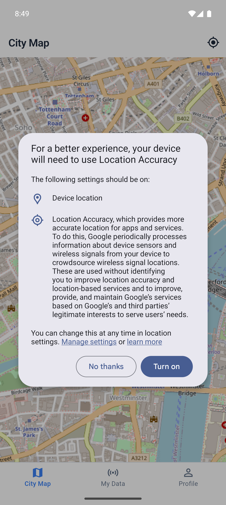
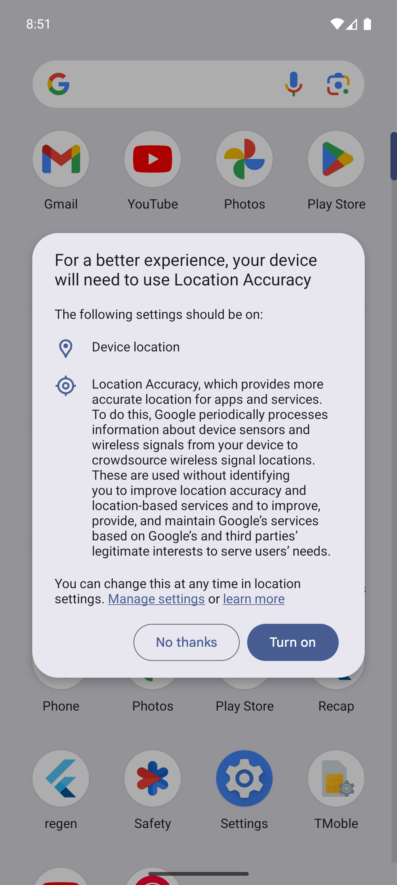

<div align="center">
  

  # DataCommons

  **A Crowdsourced Smartphone Sensor Data Platform**

  [](https://flutter.dev)
  [](https://firebase.google.com)
  [](https://opensource.org/licenses/MIT)

  DataCommons allows users to seamlessly record, visualize, and export data from all built-in smartphone sensors. It features a robust background service to continue logging tracks even when the app is minimized.
</div>

<br/>

## 📸 Screenshots

<div align="center">
  
  &nbsp;&nbsp;&nbsp;&nbsp;&nbsp;&nbsp;&nbsp;&nbsp;
  
</div>

---

## ✨ Features

- **📍 Centralized Dashboard:** Overview of your current active sensors and total collected records.
- **🗺️ City Map:** Real-time location tracking rendered on crisp OpenStreetMap tiles.
- **🚶‍♂️ Step Counter:** Weekly pedometer charts parsing real-time step streams.
- **🧭 GPS & Accelerometer & Gyroscope:** Beautiful dynamic line charts representing spatial tracking and full 3-axis motion data.
- **📸 Camera Tagging:** Capture geolocated, annotated photos and sync them directly to the map.
- **⛰️ Barometer & Altitude:** Advanced sensor visualizations for atmospheric pressure and elevation.
- **🔄 Background execution:** A reliable Android foreground service keeps your sessions alive when you close the app.
- **📤 Export Engine:** Quickly generate and share `.gpx` files or raw CSV exports straight to your phone's native Share Sheet.

---

## 🛠 Tech Stack

- **Framework:** Flutter & Dart
- **State Management:** Riverpod (`flutter_riverpod`)
- **Navigation:** `go_router` (with Branch/Shell routing)
- **Maps:** `flutter_map` + `latlong2`
- **Charts:** `fl_chart`
- **Local Database:** `sqflite` + `hive`
- **Backend/Auth:** Firebase Auth & Firestore

---

## 🚀 Getting Started

### Prerequisites

- Flutter SDK (>= 3.0.0)
- Android Studio / SDK tools
- (Optional) physical Android device for accurate sensor data. Emulator sensors are often mocked or missing.

### Installation

1. **Clone the repository:**
   ```bash
   git clone https://github.com/ArunJoseph19/DataCommons.git
   cd DataCommons
   ```

2. **Install dependencies:**
   ```bash
   flutter pub get
   ```

3. **Firebase Setup:**
   You must connect the app to your own Firebase project:
   - Create a Firebase project.
   - Register an Android app (`com.datacommons.app`).
   - Download the `google-services.json` file.
   - Place it inside the `android/app/` directory.

4. **Run the app:**
   ```bash
   flutter run
   ```

### Building the APK

To build a standalone APK for your Android device:

```bash
flutter build apk --release
```
The file will be output to: `build/app/outputs/flutter-apk/app-release.apk`

---

## 🤝 Contribution

Feel free to fork this project, submit PRs, or open issues. All contributions that improve the sensor readings or add useful visualizations are welcome!

